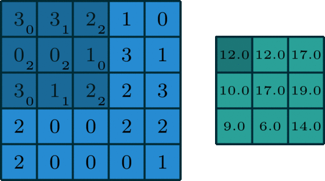
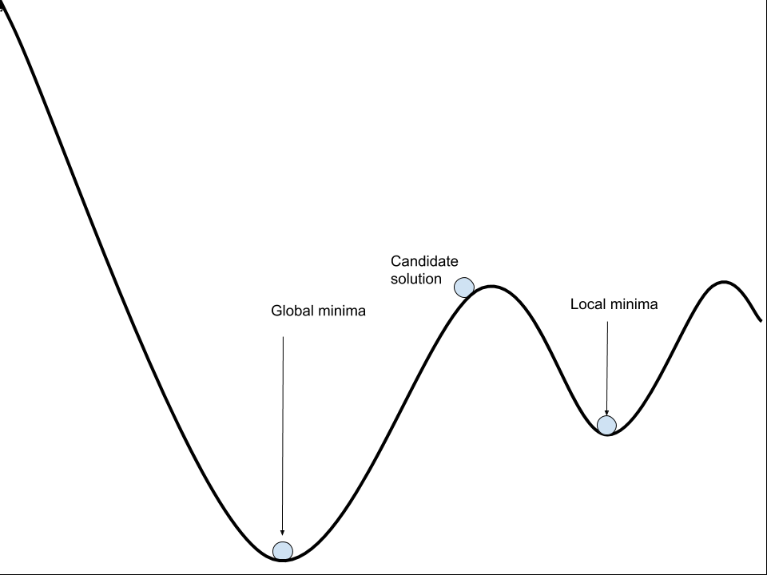

    

        <h1  style="color:maroon; text-align: left; font-size:25px;">EVA Assignment: 1.1</h1>
        
<i>Author(s): </i> <strong>Shubhra Prakash</strong> 

               
<i>Modified: July 13th, 2020</i> 

    

    

# What are Channels and Kernels (according to EVA)?

<strong> Kernels </strong>
Kernels-are the unique 2D array of weights which convolves onto an input channel of the previous layer to generate one output channel.Each kernel focuses on specific aspects of the input channel in an image.The kernels can also be thought of as feature extractors

<strong> Filters </strong>
A filter is a collection of kernels.

<strong> Channels</strong>
Channel is a collection of similar features.It can be thought of as a feature map generated by a kernel after the convolution.Channels are the building blocks of a layer in DNN. 

Image Source [Link](https://towardsdatascience.com/intuitively-understanding-convolutions-for-deep-learning-1f6f42faee1)

#  Why should we (nearly) always use 3x3 kernels?

- <strong>Axis of symmetry</strong>- odd numbered kernels have axis of symmetry
- <strong>Usage</strong>- 3X3 matrix can be used to form any other odd numbered matrix
- <strong>GPU</strong>-Most of the GPU manufacturers have accelarated usage of 3X3 for their products

# How many times to we need to perform 3x3 convolutions operations to reach close to 1x1 from 199x199 (type each layer output like 199x199 > 197x197...)

<strong>We need to perform 99 (3x3) convolutions operations to reach close to 1x1 from 199x199 </strong>

<strong>Calculations</strong>

199X199<|3X3|>197X197 

197X197<|3X3|>195X195 

195X195<|3X3|>193X193 

193X193<|3X3|>191X191 

191X191<|3X3|>189X189 

189X189<|3X3|>187X187 

187X187<|3X3|>185X185 

185X185<|3X3|>183X183 

183X183<|3X3|>181X181 

181X181<|3X3|>179X179 

179X179<|3X3|>177X177 

177X177<|3X3|>175X175 

175X175<|3X3|>173X173 

173X173<|3X3|>171X171 

171X171<|3X3|>169X169 

169X169<|3X3|>167X167 

167X167<|3X3|>165X165 

165X165<|3X3|>163X163 

163X163<|3X3|>161X161 

161X161<|3X3|>159X159 

159X159<|3X3|>157X157 

157X157<|3X3|>155X155 

155X155<|3X3|>153X153 

153X153<|3X3|>151X151 

151X151<|3X3|>149X149 

149X149<|3X3|>147X147 

147X147<|3X3|>145X145 

145X145<|3X3|>143X143 

143X143<|3X3|>141X141 

141X141<|3X3|>139X139 

139X139<|3X3|>137X137 

137X137<|3X3|>135X135 

135X135<|3X3|>133X133 

133X133<|3X3|>131X131 

131X131<|3X3|>129X129 

129X129<|3X3|>127X127 

127X127<|3X3|>125X125 

125X125<|3X3|>123X123 

123X123<|3X3|>121X121 

121X121<|3X3|>119X119 

119X119<|3X3|>117X117 

117X117<|3X3|>115X115 

115X115<|3X3|>113X113 

113X113<|3X3|>111X111 

111X111<|3X3|>109X109 

109X109<|3X3|>107X107 

107X107<|3X3|>105X105 

105X105<|3X3|>103X103 

103X103<|3X3|>101X101 

101X101<|3X3|>99X99 

99X99<|3X3|>97X97 

97X97<|3X3|>95X95 

95X95<|3X3|>93X93 

93X93<|3X3|>91X91 

91X91<|3X3|>89X89 

89X89<|3X3|>87X87 

87X87<|3X3|>85X85 

85X85<|3X3|>83X83 

83X83<|3X3|>81X81 

81X81<|3X3|>79X79 

79X79<|3X3|>77X77 

77X77<|3X3|>75X75 

75X75<|3X3|>73X73 

73X73<|3X3|>71X71 

71X71<|3X3|>69X69 

69X69<|3X3|>67X67 

67X67<|3X3|>65X65 

65X65<|3X3|>63X63 

63X63<|3X3|>61X61 

61X61<|3X3|>59X59 

59X59<|3X3|>57X57 

57X57<|3X3|>55X55 

55X55<|3X3|>53X53 

53X53<|3X3|>51X51 

51X51<|3X3|>49X49 

49X49<|3X3|>47X47 

47X47<|3X3|>45X45 

45X45<|3X3|>43X43 

43X43<|3X3|>41X41 

41X41<|3X3|>39X39 

39X39<|3X3|>37X37 

37X37<|3X3|>35X35 

35X35<|3X3|>33X33 

33X33<|3X3|>31X31 

31X31<|3X3|>29X29 

29X29<|3X3|>27X27 

27X27<|3X3|>25X25 

25X25<|3X3|>23X23 

23X23<|3X3|>21X21 

21X21<|3X3|>19X19 

19X19<|3X3|>17X17 

17X17<|3X3|>15X15 

15X15<|3X3|>13X13 

13X13<|3X3|>11X11 

11X11<|3X3|>9X9 

9X9<|3X3|>7X7 

7X7<|3X3|>5X5 

5X5<|3X3|>3X3 

3X3<|3X3|>1X1 

# How are kernels initialized?

**The kernels are initialized at a small random value so that a stochastic optimization algorithm can be used to minimize the cost function**

At the starting of the problem, we do not have an understanding of the structure of the search space.Training algorithms for deep learning models are usually iterative in nature and thus require the user to specify some initial point from which to begin the iterations.Therefore, to remove bias from the search process, we start from a randomly chosen position. While optimizing the cost function the optimization algorithm might get stuck in a local optima, randomness during the search process increases the probability of getting unstuck, provides multiple opportunities to start and traverse the space and find a better optimal solution.

**Why not initialize with same values?(Zeros or ones)**

Usually multiple perceptrons with the same activation function are connected to the same inputs, if they have the same initial parameters, then a deterministic learning algorithm applied to a deterministic cost and model will constantly update both of these units in the same way.This will make it difficult to break symmetry here.

Image Source [Link](https://machinelearningmastery.com/why-training-a-neural-network-is-hard/)

# What happens during the training of a DNN?

Deep Learning Model Life-Cycle involves following steps:

* Step 1: Prepare the Data
* Step 2: Define the Model
* Step 3: Train the Model
* Step 4: Evaluate the Model
* Step 5: Make Predictions

Training of the DNN involves increase the accuracy by iterating over a training data set while tweaking the parameters(the weights and biases) of the model.The training mainly revolves around decreasing the prediction error or **cost**. By minimizing the loss with respect to the network parameters, we can find a state where the loss is at a minimum and the network is able to predict the correct labels at a high accuracy. We find this minimum loss using a process called **gradient descent**.The aim of the algorithm is getting to the lowest error value. The gradient is the slope of the loss function and points in the direction of fastest change until we get to the bottom of our graph, or to a point where we can no longer move downhill. 

# References
* [Intuitively Understanding Convolutions for Deep Learning](https://towardsdatascience.com/intuitively-understanding-convolutions-for-deep-learning-1f6f42faee1)
* [A Comprehensive Introduction to Different Types of Convolutions in Deep Learning](https://towardsdatascience.com/a-comprehensive-introduction-to-different-types-of-convolutions-in-deep-learning-669281e58215#:~:text=A%20layer%20could%20have%20multiple,%E2%80%9D%20(%E2%80%9Ckernel%E2%80%9D).)
* [Why Initialize a Neural Network with Random Weights?](https://machinelearningmastery.com/why-initialize-a-neural-network-with-random-weights/)
* [Weight Initialization Techniques in Neural Networks](https://towardsdatascience.com/weight-initialization-techniques-in-neural-networks-26c649eb3b78)

